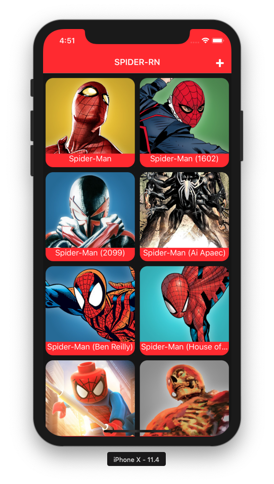
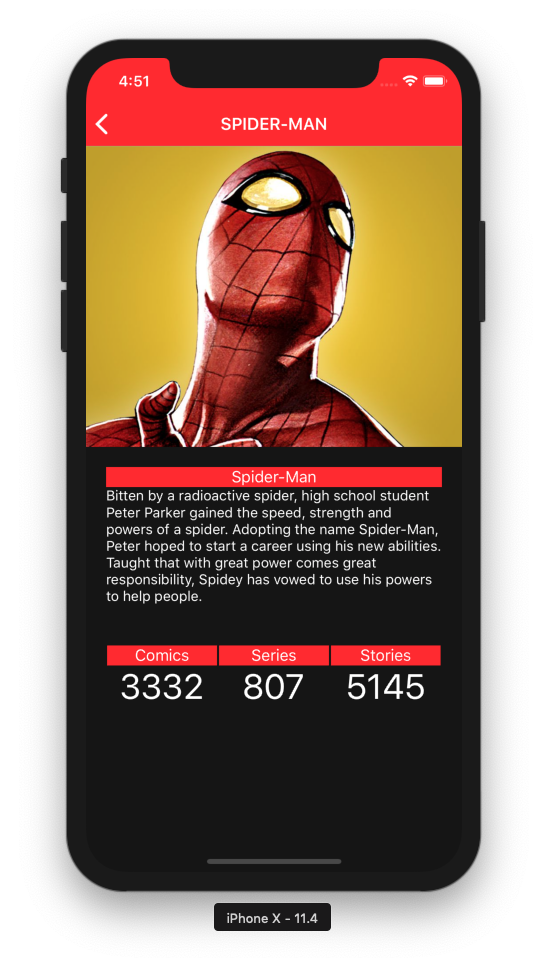
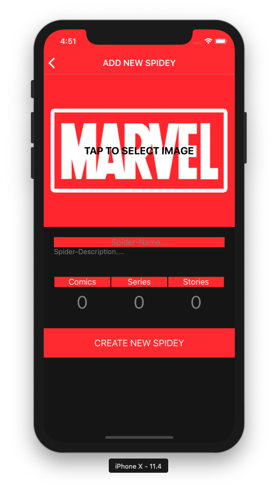

# Práctica de programación React Native Boot VI (2018)
## Por Brais Moure Morais

Wiki sobre Spider-Man nutrida con datos del API de [Marvel](https://developer.marvel.com/).

## Características
* Listado de todos los Spider-Man del universo Marvel.
* Nombre, descripción, número de cómics, series y relatos en los que aparece cada uno de los Spider-Man.
* Posibilidad de añadir tu propio Spider-Man (no persiste en el API).

## Requisitos
* Homebrew: [Install Homebrew](https://brew.sh/index_es)
* Node.js: [Download Node.js](https://nodejs.org/en/download/)
* Watchman: [Download Watchman](https://facebook.github.io/watchman/docs/install.html)
* React Native: [Getting Started](https://facebook.github.io/react-native/docs/getting-started.html)
* Xcode: [Download Xcode](https://developer.apple.com/xcode/) (Probado en versión 9.4.1)
* Android Studio + Android SDK: [Download Android Studio](https://developer.android.com/studio/)

## Configuración

1. Dado que el proyecto utiliza un API Key privada para acceder a marvel.com, deberemos registrarnos en [https://developer.marvel.com/](https://developer.marvel.com/) y obtener una clave de acceso.
2. Una vez tengamos la clave, crearemos un fichero `.env` como el ya incluído `.env.example` en el que coloremos el valor de nuestra clave de acceso a continuación del signo igual.
3. Instalar las dependencias del proyecto. Nos colocaremos en su raíz y ejecutaremos `npm install`.

`MARVEL_API_KEY=my_marvel_api_key`

## Instalación

1. Iniciar el servidor Node.js con `npm start`.
2. Instalar la app en iOS con `react-native run-ios` o en Android con `react-native run-android`.

## Preview

### Autor
*Brais Moure Morais. © 2017-2018*